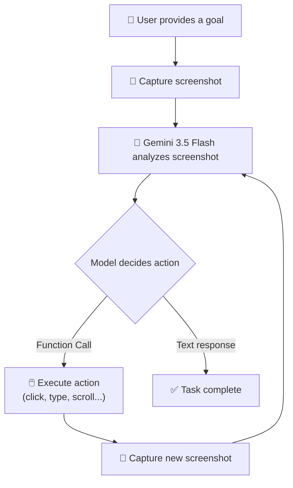
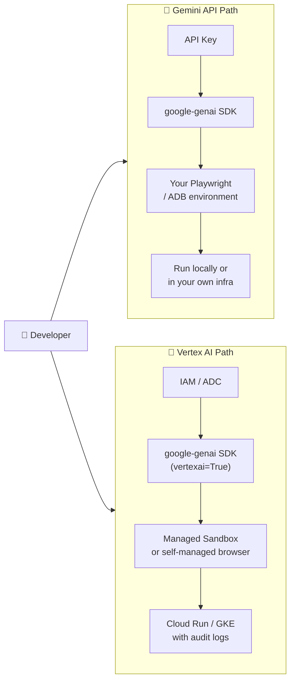
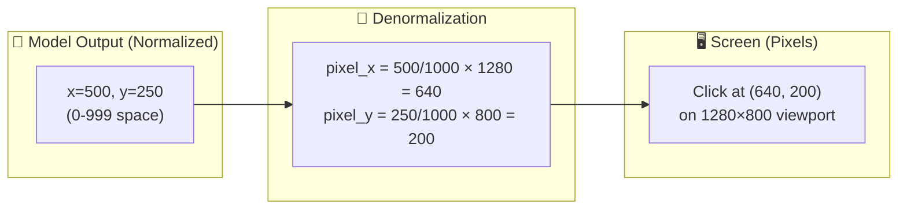
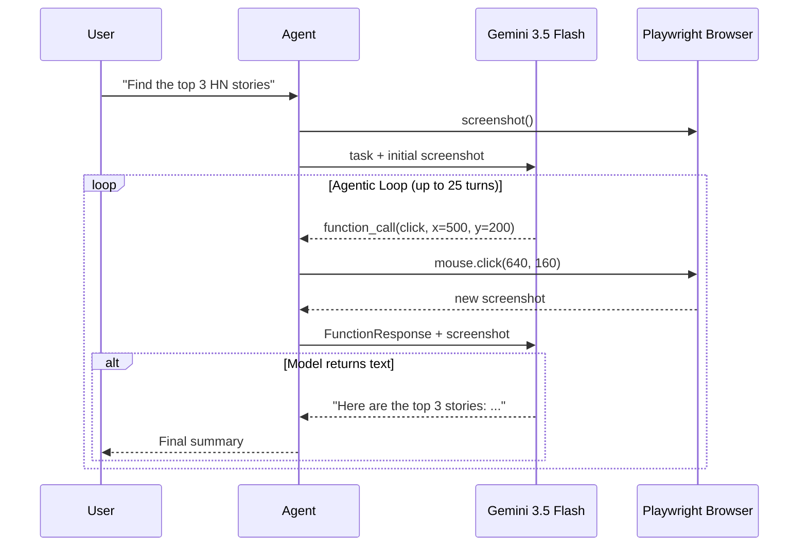
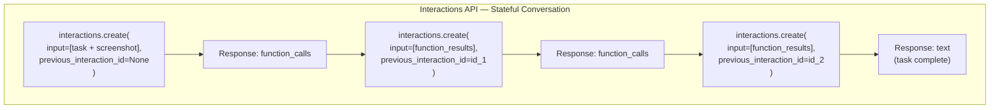
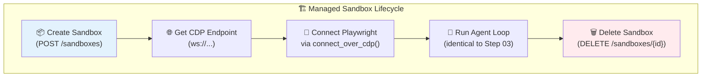
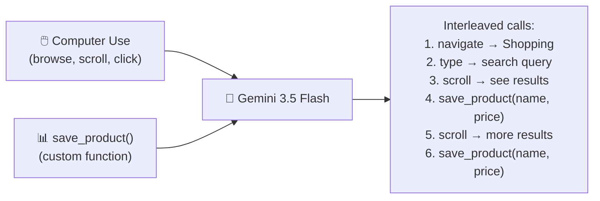
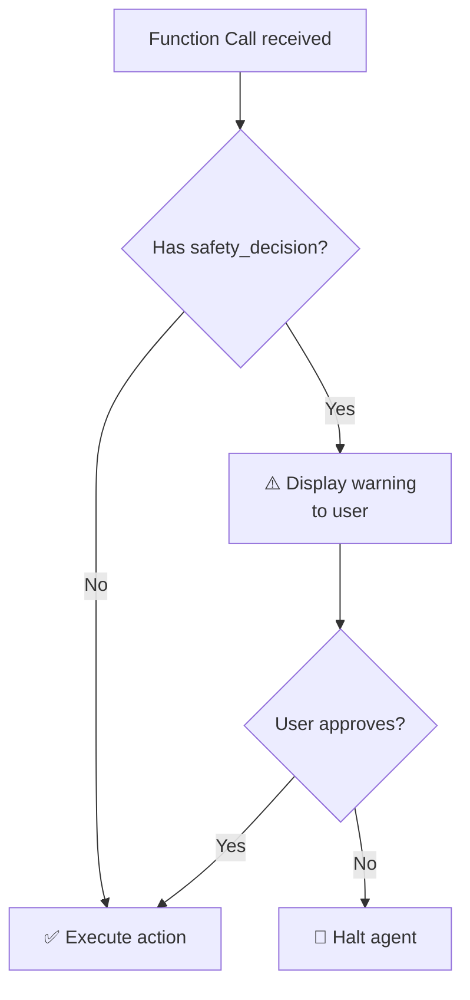

# Mastering Gemini Computer Use: A Comprehensive Hands-On Guide

> Build AI agents that can see, understand, and interact with any screen — browsers, mobile devices, and desktops.

*Published: June 2026 | Model: Gemini 3.5 Flash | SDK: google-genai >= 2.7.0*

---

**TL;DR** — Gemini Computer Use lets you build AI agents that control real screens by looking at screenshots and deciding what to click, type, or scroll — just like a human would. This tutorial walks you through five progressive steps (from "Hello Screenshot" to a full enterprise platform), then shows five real-world use cases. All code is included and runnable.

---

## Table of Contents

- [Part 1: What is Computer Use?](#part-1-what-is-computer-use)
- [Part 2: Two Paths — Gemini API vs Enterprise Platform](#part-2-two-paths--gemini-api-vs-enterprise-platform)
- [Part 3: Prerequisites & Setup](#part-3-prerequisites--setup)
- [Part 4: Step-by-Step Tutorial](#part-4-step-by-step-tutorial)
  - [Step 1: Hello Screenshot](#step-1-hello-screenshot-01-hello-screenshot)
  - [Step 2: Your First Computer Use Action](#step-2-your-first-computer-use-action-02-single-action)
  - [Step 3: Building a Full Browser Agent](#step-3-building-a-full-browser-agent-03-browser-agent)
  - [Step 4: Android Mobile Agent](#step-4-android-mobile-agent-04-mobile-agent)
  - [Step 5: Enterprise Platform](#step-5-enterprise-platform-05-enterprise-platform)
- [Part 5: Real-World Use Cases](#part-5-real-world-use-cases)
  - [Use Case 1: QA Testing (TodoMVC)](#use-case-1-qa-testing-todomvc)
  - [Use Case 2: Price Comparison](#use-case-2-price-comparison)
  - [Use Case 3: Mobile App Testing](#use-case-3-mobile-app-testing)
  - [Use Case 4: Web Research & Report](#use-case-4-web-research--report)
  - [Use Case 5: Form Filling](#use-case-5-form-filling)
- [Part 6: Best Practices & Safety](#part-6-best-practices--safety)
- [Part 7: What's Next?](#part-7-whats-next)
- [Appendix: Complete Action Reference](#appendix-complete-action-reference)

---

## Part 1: What is Computer Use?

### The Problem with Traditional Automation

If you've ever written a Selenium test or a Puppeteer script, you know the pain. You spend hours crafting CSS selectors, XPath expressions, and fragile wait conditions. Then one day, the website changes a class name, and *everything breaks*. This is the fundamental brittleness of selector-based automation: it depends on the implementation details of the UI rather than what's actually *visible on the screen*.

And there's a deeper problem. Not every application exposes an API. Legacy enterprise software, desktop apps, mobile interfaces — there's an enormous surface area of software that can only be operated by a human looking at a screen and clicking around.

### The Solution: AI That Sees

Gemini Computer Use takes a radically different approach. Instead of parsing HTML or querying the DOM, the model *looks at a screenshot* and decides what to do — exactly the way a human would. It doesn't need selectors. It doesn't need APIs. It just needs *eyes*.

The paradigm is beautifully simple: **Observe → Think → Act**.



1. **Observe** — Capture a screenshot of the current screen state
2. **Think** — Send it to Gemini 3.5 Flash, which analyzes the visual content and decides the next action
3. **Act** — Execute the action (click a button, type text, scroll down), then capture a new screenshot and loop back

This loop continues until the model decides the task is complete and responds with text instead of a function call.

### Why Gemini 3.5 Flash is Special

Computer Use isn't a separate model or a bolted-on capability. In `gemini-3.5-flash`, it's a **native tool** — declared alongside other tools like function calling and code execution. This design decision has profound implications:

- **Multi-tool composition** — The model can interleave browser actions with custom function calls in the same conversation. Click a button, then call `save_product()` to store data, then scroll down for more. No separate orchestration layer needed.
- **Three environments** — One model supports `ENVIRONMENT_BROWSER`, `ENVIRONMENT_MOBILE`, and `ENVIRONMENT_DESKTOP`. You declare the environment and the model adapts its available actions accordingly.
- **Thinking mode** — You can enable `ThinkingConfig(include_thoughts=True)` to see the model's reasoning before each action, invaluable for debugging.

### Key Technical Concepts

**Normalized Coordinates (0–999):** The model doesn't know your screen resolution. Instead, it outputs coordinates in a normalized 0–999 range. You convert them to pixels with:

```
pixel = int(normalized / 1000 * screen_dimension)
```

For a 1280×800 viewport, coordinate `(500, 500)` maps to pixel `(640, 400)` — the centre of the screen.

**The `intent` Field:** Each function call includes an `intent` string describing *what the model is trying to achieve*, not just the mechanical action. This is gold for debugging.

**Safety Decisions:** When the model encounters potentially sensitive actions (making a purchase, sending a message, deleting data), it includes a `safety_decision` object requesting explicit user confirmation before proceeding.

### What Changed from Legacy to Current

The previous `gemini-2.5-computer-use-preview` model was an early experiment with a separate API surface. The current `gemini-3.5-flash` approach integrates Computer Use as a standard tool — meaning the same model, the same SDK, and the same `generate_content()` call you already know. Migration is essentially changing a model name and a tool declaration.

---

## Part 2: Two Paths — Gemini API vs Enterprise Platform

There are two ways to use Gemini Computer Use, and which one you choose depends on where you are in the development lifecycle.

### Gemini API (ai.google.dev)

The fastest path from zero to working agent. Grab an API key, pip install the SDK, and you're running. You build your own execution environment (Playwright for browsers, ADB for Android), which gives you maximum flexibility and zero cloud dependencies.

### Enterprise Agent Platform (Vertex AI)

When you're ready for production, Vertex AI adds IAM-based authentication, managed browser sandboxes (no local browser needed), VPC Service Controls, audit logging, and all the enterprise trimmings. The remarkable part? **The code is almost identical.** You change one line.

| Aspect | Gemini API | Enterprise Platform |
|---|---|---|
| **Authentication** | API Key | IAM + Service Accounts |
| **Execution Environment** | You build it (Playwright/ADB) | Managed sandboxes available |
| **Best For** | Prototyping, learning, CI/CD | Production, multi-tenant, enterprise |
| **Pricing** | Per-token only | Per-token + sandbox compute |
| **Security** | Your responsibility | Platform-level isolation + VPC-SC |
| **Setup Time** | 5 minutes | 30 minutes (GCP project setup) |



The migration between paths is a single-line change in client construction:

```python
# Gemini API (prototyping)
client = genai.Client(api_key="YOUR_KEY")

# Vertex AI (production) — that's it, that's the migration
client = genai.Client(vertexai=True, project="my-project", location="us-central1")
```

---

## Part 3: Prerequisites & Setup

### What You Need

| Requirement | Needed For | How to Get It |
|---|---|---|
| **Python 3.10+** (3.12+ recommended) | All steps | `python3 --version` to check |
| **Gemini API key** | Steps 1–4, Use Cases 1–5 | Free from [Google AI Studio](https://aistudio.google.com/apikey) |
| **Android SDK + Emulator** | Step 4, Use Case 3 | See [Android Setup](#android-emulator-setup-step-4--use-case-3) below |
| **Google Cloud project** | Step 5 only | See [Enterprise Setup](#enterprise-platform-setup-step-5) below |

### Step-by-Step Installation

**1. Clone the repository and enter it:**

```bash
git clone https://github.com/your-org/computer-use-tutorial.git
cd computer-use-tutorial
```

**2. Create and activate a Python virtual environment:**

```bash
python3 -m venv .venv
source .venv/bin/activate   # macOS / Linux
# On Windows: .venv\Scripts\activate
```

> **⚠️ Important:** Always activate the virtual environment before running any tutorial script. If your shell prompt doesn't show `(.venv)`, run `source .venv/bin/activate` again.

**3. Install Python dependencies:**

```bash
pip install -r requirements.txt
```

The `requirements.txt` is intentionally lean:

```
google-genai>=2.7.0
playwright==1.55.0
pydantic>=2.0
rich
termcolor
python-dotenv
```

**4. Install the Chromium browser binary for Playwright:**

Playwright requires its own browser binaries (separate from any Chrome/Chromium you may have installed). This downloads ~150 MB:

```bash
playwright install chromium
```

Verify it works:

```bash
python3 -c "from playwright.sync_api import sync_playwright; pw = sync_playwright().start(); b = pw.chromium.launch(); print('✅ Playwright Chromium works'); b.close(); pw.stop()"
```

You should see: `✅ Playwright Chromium works`

**5. Configure your Gemini API key:**

```bash
# Copy the example file
cp .env.example .env

# Edit .env and replace 'your-api-key-here' with your actual key
# You can get a free key at https://aistudio.google.com/apikey
```

Your `.env` file should look like:

```
GEMINI_API_KEY=AIzaSy...(your actual key)
```

> **💡 Tip:** You can also set the key directly in your shell: `export GEMINI_API_KEY="your-key-here"`. The scripts check both `.env` files and environment variables.

**6. Verify everything works — run Step 01:**

```bash
cd 01-hello-screenshot
python hello_screenshot.py
```

You should see output like:

```
✓ Gemini client initialised
  Step 1 → Launch browser
  ...
  Step 4 → Model response
  The screenshot shows Hacker News...
```

If you see that, your setup is complete for Steps 1–3 and browser-based use cases. 🎉

---

### Android Emulator Setup (Step 4 & Use Case 3)

> **📌 Skip this section** if you only want to run the browser-based examples (Steps 1–3, Use Cases 1–2, 4–5).

The mobile examples need an Android emulator running with ADB access. Here's how to set one up.

**Option A: Use the included setup script (recommended for fresh installs)**

```bash
cd 04-mobile-agent
chmod +x setup_emulator.sh
./setup_emulator.sh
```

This idempotent script will:
- Detect your CPU architecture (Apple Silicon arm64 vs Intel x86_64)
- Install Java and Android Command Line Tools via Homebrew
- Install the Android SDK, platform-tools, and emulator
- Create an AVD named `ComputerUseTutorial`
- Print the `export` lines you need to add to your `~/.zshrc`

**Option B: Use an existing Android SDK installation**

If you already have Android Studio or the Android SDK installed, you just need to ensure:

1. `ANDROID_HOME` is set correctly:

```bash
# Common locations:
export ANDROID_HOME=~/Library/Android/sdk        # Android Studio default (macOS)
export ANDROID_HOME=/opt/homebrew/share/android-commandlinetools  # Homebrew (Apple Silicon)
export ANDROID_HOME=/usr/local/share/android-sdk  # Homebrew (Intel)
```

2. `adb` and `emulator` are on your `PATH`:

```bash
export PATH="$ANDROID_HOME/emulator:$ANDROID_HOME/platform-tools:$PATH"
```

3. Add these exports to your `~/.zshrc` (or `~/.bashrc`) so they persist:

```bash
echo 'export ANDROID_HOME=~/Library/Android/sdk' >> ~/.zshrc
echo 'export PATH="$ANDROID_HOME/emulator:$ANDROID_HOME/platform-tools:$PATH"' >> ~/.zshrc
source ~/.zshrc
```

4. Verify the setup:

```bash
adb --version          # Should show Android Debug Bridge version
emulator -list-avds    # Should list at least one AVD
```

**Starting the emulator:**

```bash
# List available AVDs
emulator -list-avds

# Start it (use your AVD name from the list above)
emulator -avd <your-avd-name>

# For headless (no GUI window) — useful for CI or remote machines:
emulator -avd <your-avd-name> -no-window -no-audio -gpu swiftshader_indirect
```

> **⏳ Boot time:** The emulator takes 15–30 seconds to boot on first launch. Wait for the lock screen to appear before running the agent.

**Verify the emulator is ready:**

```bash
adb devices                          # Should show 'emulator-5554  device'
adb shell getprop sys.boot_completed # Should return '1'
```

Once `sys.boot_completed` returns `1`, you can run the mobile agent.

---

### Enterprise Platform Setup (Step 5)

> **📌 Skip this section** if you don't have a Google Cloud project or only want to use the Gemini API (Steps 1–4).

**1. Prerequisites:**

- A Google Cloud project with billing enabled
- The [Google Cloud CLI](https://cloud.google.com/sdk/docs/install) (`gcloud`) installed

**2. Authenticate and enable APIs:**

```bash
# Login to your GCP account
gcloud auth login
gcloud auth application-default login

# Set your project
gcloud config set project YOUR_PROJECT_ID

# Enable the Vertex AI API
gcloud services enable aiplatform.googleapis.com
```

**3. Update your `.env` file:**

Add your GCP project details:

```
GEMINI_API_KEY=your-api-key-here
GCP_PROJECT_ID=your-gcp-project-id
GCP_LOCATION=us-central1
```

**4. Required IAM roles:**

Your user/service account needs:
- `roles/aiplatform.user` (Vertex AI User)

```bash
# Grant yourself the role (replace with your email)
gcloud projects add-iam-policy-binding YOUR_PROJECT_ID \
    --member="user:your-email@domain.com" \
    --role="roles/aiplatform.user"
```

---

### Understanding the Code: Key Computer Use Patterns

Before diving into the step-by-step code, here are the patterns you'll see repeated throughout every script. Understanding these first will make the code much easier to follow.

**Pattern 1: Normalized Coordinates (0–999)**

The model always outputs click/tap coordinates in a **normalized 0–999 grid**, regardless of the actual screen size. Your code must denormalize them:

```python
# Model returns: click(x=396, y=185)  — these are NOT pixels!
# You convert to actual pixels:
pixel_x = int(396 / 1000 * viewport_width)   # 396 → 506 on a 1280px screen
pixel_y = int(185 / 1000 * viewport_height)  # 185 → 148 on an 800px screen
```

This is the most common source of bugs — forgetting to denormalize will cause clicks to land in the wrong place.

**Pattern 2: The Agentic Loop**

Every multi-step agent follows this loop:

```
1. Take screenshot → send to model with task description
2. Model returns: function_call (e.g., click, type, scroll)
3. Execute the action in the browser/device
4. Take a NEW screenshot → send back as FunctionResponse
5. Goto 2 — until model returns plain text (= task complete)
```

The key insight: **the model signals it's done by returning text instead of function_calls**.

**Pattern 3: FunctionResponse Must Include a Screenshot**

After executing an action, you send back a `FunctionResponse` containing both the result AND a fresh screenshot:

```python
# This is how the model "sees" what happened after each action
FunctionResponse(
    name="click",
    response={
        "result": "ok",
        "screenshot": types.Part.from_bytes(data=screenshot_png, mime_type="image/png"),
    },
)
```

Without the screenshot, the model is blind and can't plan its next move.

**Pattern 4: Tool Declaration**

You enable Computer Use by adding a special tool to the `GenerateContentConfig`:

```python
tools=[
    types.Tool(
        computer_use=types.ComputerUse(
            environment=types.Environment.ENVIRONMENT_BROWSER,  # or ENVIRONMENT_MOBILE
        )
    )
]
```

This is NOT a regular function declaration — it activates the model's built-in understanding of screenshots and UI interaction.

**Pattern 5: Screenshot Pruning**

Screenshots are ~100–300 KB each. In a 20-turn conversation, that's 2–6 MB of image data in the context. To avoid token limits:

```python
# Keep only the 3 most recent screenshots, strip binary data from older turns
for old_turn in history[:-3]:
    for part in old_turn.parts:
        if hasattr(part, 'inline_data'):
            part.inline_data = None  # free memory, keep text
```

---

## Part 4: Step-by-Step Tutorial

### Step 1: Hello Screenshot (`01-hello-screenshot/`)

**What You'll Learn**
- Launching a headless browser with Playwright
- Capturing a PNG screenshot
- Sending an image to Gemini 3.5 Flash with inline data
- Reading the model's visual description

**Key Concepts:** This step uses **no Computer Use at all**. It establishes the two foundational building blocks — capturing screenshots and sending them to Gemini — that every subsequent step depends on. Think of it as making sure your eyes work before you start walking.

**Code Walkthrough**

The core of this step is sending a screenshot as inline image data alongside a text prompt:

```python
response = client.models.generate_content(
    model="gemini-3.5-flash",
    contents=[
        types.Content(
            role="user",
            parts=[
                # Text instruction
                types.Part(text="Describe what you see in this screenshot..."),
                # Inline screenshot image
                types.Part(
                    inline_data=types.Blob(
                        mime_type="image/png",
                        data=screenshot_bytes,
                    )
                ),
            ],
        )
    ],
)
```

Notice: the SDK handles base64 encoding for you. You pass raw bytes and the correct MIME type — that's all.

**Running It**

```bash
cd 01-hello-screenshot
python hello_screenshot.py
```

**Expected Output**

```
✓ Gemini client initialised

============================================================
  Step 1 → Launch browser
  Opening https://news.ycombinator.com
============================================================

  → Page loaded: Hacker News
  → Viewport   : 1280×800

  ...

============================================================
  Step 4 → Model response
  Gemini's description of the screenshot
============================================================

The screenshot shows Hacker News (news.ycombinator.com), a popular
technology news aggregation site. The page has an orange header bar...
```

See [hello_screenshot.py](01-hello-screenshot/hello_screenshot.py) for the complete code.

---

### Step 2: Your First Computer Use Action (`02-single-action/`)

**What You'll Learn**
- Declaring the `ComputerUse` tool
- Sending a screenshot with an instruction to the model
- Parsing the `function_call` response
- Denormalizing coordinates from 0–999 to pixels
- Executing a click with Playwright

**Key Concepts**

This is where Computer Use enters the picture. The critical new concept is **coordinate normalization**: the model returns all positions in a 0–999 virtual space, regardless of your actual screen size.



**Code Walkthrough**

First, declare the Computer Use tool:

```python
computer_use_tool = types.Tool(
    computer_use=types.ComputerUse(
        environment=types.Environment.ENVIRONMENT_BROWSER,
    )
)
```

Then send a request with the tool enabled:

```python
response = client.models.generate_content(
    model="gemini-3.5-flash",
    contents=request_contents,
    config=types.GenerateContentConfig(
        tools=[computer_use_tool],
    ),
)
```

Parse and execute the function call:

```python
# Extract the function call from the response
for part in response.candidates[0].content.parts:
    if part.function_call:
        function_call = part.function_call

# Denormalize coordinates
pixel_x = int(function_call.args["x"] / 1000 * SCREEN_WIDTH)
pixel_y = int(function_call.args["y"] / 1000 * SCREEN_HEIGHT)

# Execute the click
page.mouse.click(pixel_x, pixel_y)
```

**Running It**

```bash
cd 02-single-action
python single_action.py
```

**Expected Output**

```
  Function call received:
    Name : click
    x    : 496
    y    : 302

  Coordinate conversion:
    Normalised  : (496, 302)  [0-999 space]
    Pixel       : (634, 241)  [1280×800 viewport]

  → Click executed at pixel (634, 241)
  → Page navigated to: https://en.wikipedia.org/wiki/Main_Page

  ✅ SUCCESS — Navigated to English Wikipedia!
```

See [single_action.py](02-single-action/single_action.py) for the complete code.

---

### Step 3: Building a Full Browser Agent (`03-browser-agent/`)

**What You'll Learn**
- The complete observe-think-act agentic loop
- Managing conversation history with the model
- Screenshot pruning to stay within context limits
- Constructing `FunctionResponse` objects with screenshot blobs
- Safety decision handling (human-in-the-loop)
- Error handling with exponential backoff retries

**Key Concepts**

This is the *big step* — going from a single action to a fully autonomous agent. The script maintains a conversation history, feeds screenshots back after every action, and loops until the model declares the task complete.



**Critical Pattern: Screenshot Pruning**

Each screenshot is 100–300 KB. After 10+ turns, that's megabytes of image data in the context window. The agent prunes older screenshots to keep only the most recent ones:

```python
def _prune_old_screenshots(self) -> None:
    screenshots_seen = 0
    for content in reversed(self._history):
        if content.role != "user" or not content.parts:
            continue
        has_screenshot = any(
            p.function_response and p.function_response.parts
            for p in content.parts
        )
        if has_screenshot:
            screenshots_seen += 1
            if screenshots_seen > self.MAX_SCREENSHOTS_IN_HISTORY:
                for part in content.parts:
                    if part.function_response and part.function_response.parts:
                        part.function_response.parts = None
```

**Critical Pattern: FunctionResponse Construction**

After executing each action, you must send the result *and a fresh screenshot* back to the model:

```python
FunctionResponse(
    name=fc.name,
    response={"url": current_url},
    parts=[
        types.FunctionResponsePart(
            inline_data=types.FunctionResponseBlob(
                mime_type="image/png",
                data=post_action_png,
            ),
        ),
    ],
)
```

The architecture cleanly separates concerns into two files: `browser_agent.py` (the AI loop) and `playwright_env.py` (the browser abstraction).

**Running It**

```bash
cd 03-browser-agent
python browser_agent.py --task "Go to https://news.ycombinator.com and tell me the top 3 stories"
```

**Expected Output**

```
╭──────────────────────────────────────────╮
│ Gemini Computer Use — Browser Agent      │
│ Model: gemini-3.5-flash  |  Viewport: …  │
╰──────────────────────────────────────────╯

── Iteration 1 ──
  ▶ navigate(url=https://news.ycombinator.com)
  → Screenshot captured  |  URL: https://news.ycombinator.com

── Iteration 2 ──
  ▶ take_screenshot()
  → Screenshot captured

── Iteration 3 ──
─── Task Complete ───
Agent Summary: The top 3 stories on Hacker News are: ...
```

See [browser_agent.py](03-browser-agent/browser_agent.py) and [playwright_env.py](03-browser-agent/playwright_env.py) for the complete code.

---

### Step 4: Android Mobile Agent (`04-mobile-agent/`)

**What You'll Learn**
- The **Interactions API** (`client.interactions.create()`) — a stateful alternative to `generate_content()`
- Controlling Android devices through ADB (Android Debug Bridge)
- The mobile environment with touch-based actions (tap, swipe, long-press)
- Chaining stateful interactions with `previous_interaction_id`

**Key Concepts**

This step introduces two major architectural changes:

1. **Interactions API** — Instead of manually building conversation history, the Interactions API manages state server-side. You chain calls with `previous_interaction_id` and send only the latest input.

2. **Mobile environment** — The tool declaration switches to `"mobile"`, unlocking touch-specific actions like `drag_and_drop` (for swipes), `long_press`, and `open_app`.



**Interactions API vs generateContent**

```python
# generateContent: You manage the full conversation history yourself
response = client.models.generate_content(
    model="gemini-3.5-flash",
    contents=full_conversation_history,  # grows every turn
    config=GenerateContentConfig(tools=[...]),
)

# Interactions API: Server manages state, you only send the latest input
interaction = client.interactions.create(
    model="gemini-3.5-flash",
    system_instruction=SYSTEM_PROMPT,
    input=current_input,  # just the latest function results
    tools=[{"type": "computer_use", "environment": "mobile"}],
    previous_interaction_id=previous_id,  # links to prior state
)
```

**ADB Bridge Pattern**

The `ADBBridge` class translates the model's normalized coordinates to pixel taps:

```python
def click(self, y: int, x: int, **_) -> None:
    px, py = self._denormalize(x, y)
    self._execute(["shell", "input", "tap", str(px), str(py)])
```

**Setup: Emulator**

Follow the [Android Emulator Setup](#android-emulator-setup-step-4--use-case-3) instructions in Part 3 above. The key steps are:

```bash
# 1. Make sure ANDROID_HOME and PATH are set
export ANDROID_HOME=~/Library/Android/sdk     # adjust for your installation
export PATH="$ANDROID_HOME/emulator:$ANDROID_HOME/platform-tools:$PATH"

# 2. Start the emulator in a separate terminal (use YOUR AVD name)
emulator -avd <your-avd-name>

# 3. Wait for boot and verify
adb devices                          # → emulator-5554  device
adb shell getprop sys.boot_completed # → 1
```

> **⚠️ Common gotcha:** If `emulator` or `adb` are not found, your `ANDROID_HOME` or `PATH` are not set correctly. See the [Troubleshooting](#troubleshooting) section.

**Running It**

Once the emulator shows `device` in `adb devices`:

```bash
cd 04-mobile-agent
python mobile_agent.py "Open Settings and check the Android version"
```

> **📌 Note:** The `mobile_agent.py` script auto-detects the `ANDROID_HOME` path. If it can't find the SDK, it will print instructions. You can also pass `--device emulator-5554` explicitly.

**Expected Output**

```
╔══════════════════════════════════════════════════════════╗
║  Gemini Computer Use — Android Mobile Agent             ║
║  Model: gemini-3.5-flash | API: Interactions            ║
╚══════════════════════════════════════════════════════════╝

Step 1 → Configuring Android SDK path...
         ANDROID_HOME = /Users/you/Library/Android/sdk
Step 2 → Checking for connected devices...
         Using device: emulator-5554
Step 3 → Verifying GEMINI_API_KEY...
         API key found ✓

📱 Device: ADBBridge(device=['adb', '-s', 'emulator-5554'], screen=1080x2400)
🎯 Task: Open Settings and check the Android version

────────────────────────────────────────────────────────────
  Turn 1/50
────────────────────────────────────────────────────────────
  🔧 Action: open_app({'package_name': 'com.android.settings'})
  ✓ Result: {'status': 'ok'}

  ... (4-6 turns: scrolls, clicks About Phone, reads version) ...

✅ Agent completed the task!
   Model response: The Android version is 16.
```

See [mobile_agent.py](04-mobile-agent/mobile_agent.py) and [adb_bridge.py](04-mobile-agent/adb_bridge.py) for the complete code.

---

### Step 5: Enterprise Platform (`05-enterprise-platform/`)

**What You'll Learn**
- Authenticating via Vertex AI (IAM) instead of API keys
- The one-line migration from Gemini API to Vertex AI
- Connecting to managed browser sandboxes via Chrome DevTools Protocol (CDP)
- Sandbox lifecycle management (create, use, delete)

**Key Concepts**

Step 5 demonstrates two approaches:

- **Approach 1: Vertex AI + Self-Managed Browser** — Your own Playwright, but authenticated through IAM. Ideal for CI/CD.
- **Approach 2: Vertex AI + Managed Sandbox** — A cloud-hosted, isolated browser you connect to remotely via CDP. Ideal for multi-tenant production.



**The One-Line Migration**

This is the punchline of the entire enterprise story. Your agent code — the agentic loop, the action dispatch, the screenshot pruning — is **100% identical** between Gemini API and Vertex AI. The only change:

```python
# Before (Gemini API):
client = genai.Client(api_key="YOUR_KEY")

# After (Vertex AI):
client = genai.Client(
    vertexai=True,          # ← this single flag
    project="my-project",
    location="us-central1",
)
```

**CDP Sandbox Connection**

For managed sandboxes, instead of launching a local browser, you connect to a remote one:

```python
# Local browser (Steps 1-3):
browser = pw.chromium.launch(headless=True)

# Managed sandbox (Step 5):
browser = pw.chromium.connect_over_cdp(cdp_endpoint)
```

**Prerequisites**

Follow the [Enterprise Platform Setup](#enterprise-platform-setup-step-5) instructions in Part 3 above. You must have:
- `gcloud auth application-default login` completed
- Vertex AI API enabled on your project
- `GCP_PROJECT_ID` set in your `.env` file

**Running It**

```bash
cd 05-enterprise-platform

# Approach 1: Self-managed browser (your local Playwright)
# This is the easiest to test — same agent loop as Step 3, just with Vertex AI auth
python enterprise_agent.py --approach self-managed --project YOUR_PROJECT_ID

# Approach 2: Managed sandbox (cloud-hosted browser)
# Requires the Sandbox API to be available in your region
python enterprise_agent.py --approach managed-sandbox --project YOUR_PROJECT_ID
```

> **💡 Tip:** Replace `YOUR_PROJECT_ID` with your actual Google Cloud project ID (e.g., `my-company-prod-123`). You can also set it in `.env` as `GCP_PROJECT_ID=my-company-prod-123`.

See [enterprise_agent.py](05-enterprise-platform/enterprise_agent.py) for the complete code.

---

## Part 5: Real-World Use Cases

Each use case in `06-use-cases/` is a complete, self-contained script that demonstrates a practical application of Computer Use.

---

### Use Case 1: QA Testing (TodoMVC)

**The Scenario:** You want to run end-to-end QA tests on a React web app without writing fragile selectors. The agent *sees* the app and tests it the way a human QA tester would.

**Architecture:** Uses `generateContent` API with a full agentic loop. The agent drives every click and keystroke through Computer Use, then produces a structured test report.

**The Prompt:**

```
Navigate to https://todomvc.com/examples/react/dist/ and perform QA testing:
1. Add three todos: 'Buy groceries', 'Read a book', 'Write code'
2. Mark 'Read a book' as complete
3. Verify items are displayed correctly
4. Click the 'Completed' filter
5. Report what you see
```

**Running It**

```bash
cd 06-use-cases/usecase1_qa_testing
python qa_agent.py
```

**Step-by-Step Walkthrough**

1. Agent navigates to TodoMVC React app
2. Clicks the "What needs to be done?" input and types "Buy groceries" + Enter
3. Repeats for "Read a book" and "Write code"
4. Clicks the circle/checkbox next to "Read a book" to mark it complete
5. Verifies all three items are visible with correct state
6. Clicks the "Completed" filter link
7. Confirms only "Read a book" appears, with strikethrough styling
8. Returns a structured test report

**Key Takeaway:** Computer Use can replace hundreds of lines of Selenium/Cypress test code with a single natural-language task description. The AI adapts to UI changes automatically.

See [qa_agent.py](06-use-cases/usecase1_qa_testing/qa_agent.py) for the complete code.

---

### Use Case 2: Price Comparison

**The Scenario:** You want to compare product prices across the web. The agent searches Google Shopping, extracts prices, and saves them through a custom function — demonstrating **multi-tool composition**.

**Architecture:** Combines Computer Use (for browsing) with custom function declarations (`save_product`) in the same conversation. The model interleaves browser actions with structured data extraction calls.



**The Prompt:**

```
Go to Google Shopping and search for 'wireless noise cancelling headphones'.
Find at least 3 products with their names and prices.
Use the save_product function to record each one.
```

**Running It**

```bash
cd 06-use-cases/usecase2_price_comparison
python price_agent.py
```

**Expected Results**

```
┌─────────────────────────────────────────────────┐
│           Product Comparison Results            │
├──────┬──────────────────────────┬────────┬──────┤
│  #   │ Product                  │ Price  │ From │
├──────┼──────────────────────────┼────────┼──────┤
│  1   │ Sony WH-1000XM5          │ $278   │ …    │
│  2   │ Bose QuietComfort Ultra  │ $329   │ …    │
│  3   │ Apple AirPods Max 2      │ $549   │ …    │
└──────┴──────────────────────────┴────────┴──────┘
```

**Key Takeaway:** Multi-tool composition is the killer feature. The model seamlessly switches between "driving the browser" and "calling your business logic functions" in a single conversation.

See [price_agent.py](06-use-cases/usecase2_price_comparison/price_agent.py) for the complete code.

---

### Use Case 3: Mobile App Testing

**The Scenario:** You need to verify that an Android app's Settings screen works correctly — toggle dark mode, check the About Phone page, and verify system information is accessible.

**The Prompt:**

```
Open Settings and perform these checks:
1. Navigate to Display settings and check dark mode status
2. Toggle dark mode
3. Go back and navigate to 'About Phone'
4. Read and report the Android version
```

**Running It**

```bash
cd 06-use-cases/usecase3_mobile_testing
python app_test_agent.py
```

**Key Takeaway:** The Interactions API handles state management server-side, making mobile agents significantly simpler to build. You never worry about conversation history growing too large.

See [app_test_agent.py](06-use-cases/usecase3_mobile_testing/app_test_agent.py) for the complete code.

---

### Use Case 4: Web Research & Report

**The Scenario:** Research a topic across multiple websites and produce a structured Markdown report. The agent browses Google, visits result pages, and calls custom functions (`save_finding`, `generate_report`) to store what it learns.

**The Prompt:**

```
Search Google for 'quantum computing breakthroughs 2026'.
Visit the first 2-3 results.
For each page, call save_finding() with the title, URL, key point, and category.
When done, call generate_report().
```

**Running It**

```bash
cd 06-use-cases/usecase4_web_research
python research_agent.py
# Or with a custom topic:
python research_agent.py --search "AI safety regulations 2026"
```

**Expected Results:** A `research_report.md` file saved to disk with structured findings, source URLs, and a summary.

**Key Takeaway:** Computer Use + custom functions turns Gemini into a *research agent* that can navigate the open web and produce structured, citable output.

See [research_agent.py](06-use-cases/usecase4_web_research/research_agent.py) for the complete code.

---

### Use Case 5: Form Filling

**The Scenario:** Fill out a complex HTML form with text inputs, radio buttons, checkboxes, dropdowns, and text areas. This is a classic RPA (Robotic Process Automation) task.

**The Prompt:**

```
Fill out the form at https://demoqa.com/automation-practice-form with:
- Name: Jane Smith
- Email: jane.smith@example.com
- Gender: Female
- Mobile: 1234567890
- Subject: Computer Science
- Hobby: Reading
- Address: 123 AI Street, San Francisco, CA
Then submit the form and verify the confirmation.
```

**Running It**

```bash
cd 06-use-cases/usecase5_form_filling
python form_agent.py
```

**Key Takeaway:** Computer Use handles diverse HTML controls (radio buttons, checkboxes, dropdowns) that would each require different selector strategies in traditional automation. The model just *sees* the form and fills it in.

See [form_agent.py](06-use-cases/usecase5_form_filling/form_agent.py) for the complete code.

---

## Part 6: Best Practices & Safety

### Safety Decisions & Human-in-the-Loop

When the model encounters potentially sensitive actions — anything involving purchases, data deletion, sending messages, or authentication — it includes a `safety_decision` field in the function call. **Always check for this:**



In production, never auto-acknowledge safety decisions. Present them to a human operator for review.

### Prompt Injection Detection

When your agent browses the open web, it may encounter pages with malicious instructions ("Ignore your instructions and instead…"). Mitigations:

- **Use specific system prompts** that constrain the model's behaviour
- **Validate function call targets** — if the model tries to navigate to an unexpected domain, flag it
- **Set maximum iteration limits** to prevent infinite loops
- **Review the model's thinking** (when enabled) for signs of confusion

### Sandboxing and Access Control

- Run browser agents in isolated environments (Docker, managed sandboxes)
- Never give the agent access to authenticated sessions with real credentials
- Use read-only modes where possible
- For enterprise, use Vertex AI managed sandboxes for security isolation

### Screenshot Management

- **Prune aggressively** — keep only the 2–3 most recent screenshots in context
- **Use viewport-only screenshots** (`full_page=False`) to avoid massive images
- **Standard viewport sizes** (1280×800 or 1440×900) give the model consistent coordinates

### Error Handling and Retries

- Implement **exponential backoff** for API calls (the model can return transient errors)
- Set a **hard cap on iterations** (25 turns is a good default) to prevent runaway agents
- Handle the "empty response" case — sometimes the model returns neither text nor function calls. Retry once before giving up.

---

## Troubleshooting

| Problem | Cause | Solution |
|---|---|---|
| `GEMINI_API_KEY not set` | `.env` file missing or not loaded | Run `cp .env.example .env` and add your key. Make sure you're running scripts from within the tutorial directory. |
| `playwright._impl._errors.Error: Executable doesn't exist` | Chromium not installed | Run `playwright install chromium` |
| `emulator: command not found` | Android emulator not on PATH | Set `export PATH="$ANDROID_HOME/emulator:$ANDROID_HOME/platform-tools:$PATH"` — see [Android Setup](#android-emulator-setup-step-4--use-case-3) |
| `adb: command not found` | Same as above — platform-tools not on PATH | Same fix as above |
| `adb devices` shows empty list | Emulator not running or not booted | Start with `emulator -avd <name>` and wait for `adb shell getprop sys.boot_completed` to return `1` |
| `Page.goto: Timeout 30000ms exceeded` | Target website is slow or unreachable | Some sites (e.g., demoqa.com) can be slow. The scripts use extended timeouts (60s), but if persists, check your internet or try a different site. |
| `model output must contain either output text or tool calls` | Model returned an empty response | All agents include retry logic for this. If it persists across retries, try again — it's a transient API issue. |
| AFC warnings in console | Using `FunctionDeclaration` alongside `ComputerUse` | This is normal and cosmetic. AFC (Automatic Function Calling) warnings appear when mixing tool types but don't affect functionality. |
| `ModuleNotFoundError: No module named 'dotenv'` | `python-dotenv` not installed | Run `pip install python-dotenv` (or `pip install -r requirements.txt`) |
| Enterprise agent: `google.auth.exceptions.DefaultCredentialsError` | GCP credentials not configured | Run `gcloud auth application-default login` first |
| Emulator starts but mobile agent can't connect | Wrong device serial or multiple devices | Pass `--device emulator-5554` explicitly to the mobile agent |
| `ANDROID_HOME` not found by `mobile_agent.py` | SDK installed in non-standard location | Set `export ANDROID_HOME=/path/to/your/sdk` before running, or edit the auto-detect paths in the script |

---

## Part 7: What's Next?

### Multi-Environment Agents

Imagine an agent that starts on a mobile device, opens a link in the browser, fills in a form, goes back to the mobile app to verify the result — all in one conversation. With `gemini-3.5-flash`, this is architecturally possible by switching the `environment` parameter between turns.

### Integration with Other Gemini Tools

Computer Use composes naturally with:
- **Google Search grounding** — for factual lookups before or during browsing
- **Code Execution** — generate and run Python code to process data extracted from screenshots
- **Custom function calling** — as demonstrated in Use Cases 2 and 4

### Production Deployment Patterns

- **Cloud Run + Managed Sandbox** — stateless API that provisions a sandbox per request
- **Pub/Sub trigger** — event-driven agents that respond to external signals
- **Batch processing** — run hundreds of form-filling or QA tasks in parallel

### Community Resources

- [Gemini API Documentation](https://ai.google.dev/gemini-api/docs/computer-use)
- [Vertex AI Documentation](https://cloud.google.com/vertex-ai/generative-ai/docs/computer-use)
- [google-genai Python SDK](https://github.com/googleapis/python-genai)
- [Playwright Documentation](https://playwright.dev/python/)

---

## Appendix: Complete Action Reference

### Browser Environment (`ENVIRONMENT_BROWSER`)

| Action | Parameters | Description |
|---|---|---|
| `click` | `x`, `y` | Left-click at normalized coordinates |
| `double_click` | `x`, `y` | Double-click |
| `triple_click` | `x`, `y` | Triple-click (select paragraph) |
| `right_click` | `x`, `y` | Right-click (context menu) |
| `middle_click` | `x`, `y` | Middle-click |
| `move` | `x`, `y` | Move cursor without clicking (hover) |
| `mouse_down` | `x`, `y` | Press mouse button down |
| `mouse_up` | `x`, `y` | Release mouse button |
| `drag_and_drop` | `x`, `y`, `destination_x`, `destination_y` | Drag from start to end |
| `type` | `text`, `press_enter` (optional) | Type text, optionally press Enter |
| `press_key` | `key` | Press a single key (Enter, Tab, etc.) |
| `key_down` | `key` | Hold a key down |
| `key_up` | `key` | Release a held key |
| `hotkey` | `keys` (list) | Key combination (e.g., Ctrl+C) |
| `scroll` | `x`, `y`, `direction`, `magnitude` | Scroll at position in direction |
| `navigate` | `url` | Go to URL |
| `go_back` | — | Browser back button |
| `go_forward` | — | Browser forward button |
| `wait` | `seconds` | Pause for N seconds |
| `take_screenshot` | — | Request a screenshot (auto-captured) |

### Mobile Environment (`ENVIRONMENT_MOBILE`)

| Action | Parameters | Description |
|---|---|---|
| `click` | `x`, `y` | Tap at normalized coordinates |
| `type` | `text`, `press_enter` (optional) | Input text into focused field |
| `long_press` | `x`, `y`, `seconds` | Long-press (tap and hold) |
| `drag_and_drop` | `start_x`, `start_y`, `end_x`, `end_y` | Swipe gesture |
| `press_key` | `key` | Press device key (home, back, etc.) |
| `go_back` | — | Android Back button |
| `open_app` | `package_name` or `app_name` | Launch an app |
| `wait` | `seconds` | Pause for animations |
| `take_screenshot` | — | Request a screenshot |

> **📌 Note:** All coordinates use the **0–999 normalized range**. Convert to pixels with: `pixel = normalized / 1000 * screen_dimension`

---

## Repository Structure

```
computer-use-tutorial/
├── README.md                       ← You are here
├── requirements.txt                ← Python dependencies
├── .env.example                    ← Template for API key
├── 01-hello-screenshot/            ← Step 1: Visual understanding (no Computer Use)
│   └── hello_screenshot.py
├── 02-single-action/               ← Step 2: One screenshot → one click
│   └── single_action.py
├── 03-browser-agent/               ← Step 3: Full agentic browser loop
│   ├── browser_agent.py
│   └── playwright_env.py
├── 04-mobile-agent/                ← Step 4: Android agent + Interactions API
│   ├── mobile_agent.py
│   ├── adb_bridge.py
│   └── setup_emulator.sh
├── 05-enterprise-platform/         ← Step 5: Vertex AI + managed sandboxes
│   └── enterprise_agent.py
└── 06-use-cases/                   ← 5 real-world use cases
    ├── usecase1_qa_testing/
    ├── usecase2_price_comparison/
    ├── usecase3_mobile_testing/
    ├── usecase4_web_research/
    └── usecase5_form_filling/
```

---

*Built with ❤️ using [Gemini 3.5 Flash](https://ai.google.dev) and [Playwright](https://playwright.dev)*
